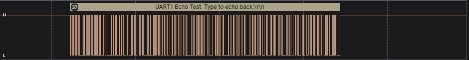

Example demonstrating the use of UART Adapter abstraction layer
===============================================================

## Overview

This application demonstrates the use of 2 UARTs through the Adapters abstraction layer.
The name of the project is **UART_Adapter_example**.

For **UART1** the echo-back is implemented without flow control since UART1 does not support RTS/CTS functionality. The echo implementation is using blocking calls of the UART adapter API via a single task. The task initiates a UART read for a single character which is transmitted back once received.

For **UART2** the echo-back is using HW flow control with RTS/CTS. The implementation of the echo-back is using two tasks, one receiving a character from PC and one transmitting a character to the UART. The implementation for the UART2 uses an OS Queue for passing the received characters to TX task.

The **system_init()** function, in the **main.c** file creates and initializes all the tasks needed as well as the OS Queue.

The configurations of all UARTs is located in the **platform_devices.c** file and the UART pin selection is located in the **peripheral_setup.h** file. There is no need to add anything in the **periph_init()** function since all the pin configurations are done from the UART adapter.

## HW and SW configuration

- **Hardware configuration**

  - This example runs on DA1459x Bluetooth Smart family devices.
  - The Pro Development kit is needed for this example.
  - Connect the Development kit to the host computer.

- **Software configuration**

  - Recommended to employ the latest e2Studio  version released.
  - Download the latest SDK version
  - SEGGER J-Link tools should be downloaded and installed.

 
### Pin Assignments

The pins configured in this example for each UART are shown below:

| UART # |  RX  |  TX  | RTSn | CTSn |
|--------|------|------|------|------|
| **UART-1** | P0_7 | P0_8 |
| **UART-2** | P1_7 | P1_8 | P1_10| P1_12| 

## test

By connecting a logic analyzer you can see the echo message between Tx and Rx:

## Known Limitations
There are no known limitations for this application.

## License
**************************************************************************************

 Copyright (c) 2025 Renesas Semiconductor. All rights reserved.

 This software ("Software") is owned by Renesas Semiconductor. By using this Software
 you agree that Renesas Semiconductor retains all intellectual property and proprietary
 rights in and to this Software and any use, reproduction, disclosure or distribution
 of the Software without express written permission or a license agreement from Renesas
 Semiconductor is strictly prohibited. This Software is solely for use on or in
 conjunction with Renesas Semiconductor products.

 EXCEPT AS OTHERWISE PROVIDED IN A LICENSE AGREEMENT BETWEEN THE PARTIES OR AS
 REQUIRED BY LAW, THE SOFTWARE IS PROVIDED "AS IS", WITHOUT WARRANTY OF ANY KIND,
 EXPRESS OR IMPLIED, INCLUDING BUT NOT LIMITED TO THE WARRANTIES OF MERCHANTABILITY,
 FITNESS FOR A PARTICULAR PURPOSE AND NON-INFRINGEMENT. EXCEPT AS OTHERWISE PROVIDED
 IN A LICENSE AGREEMENT BETWEEN THE PARTIES OR BY LAW, IN NO EVENT SHALL Renesas
 SEMICONDUCTOR BE LIABLE FOR ANY DIRECT, SPECIAL, INDIRECT, INCIDENTAL, OR
 CONSEQUENTIAL DAMAGES, OR ANY DAMAGES WHATSOEVER RESULTING FROM LOSS OF USE, DATA OR
 PROFITS, WHETHER IN AN ACTION OF CONTRACT, NEGLIGENCE OR OTHER TORTIOUS ACTION,
 ARISING OUT OF OR IN CONNECTION WITH THE USE OR PERFORMANCE OF THE SOFTWARE.

**************************************************************************************